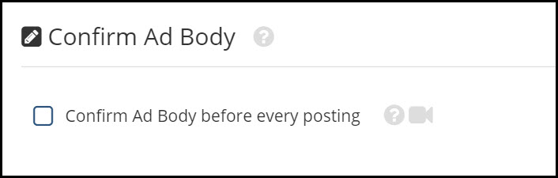
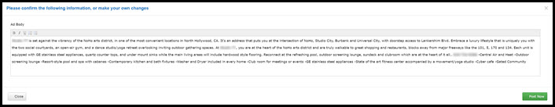

# Ad Body

This page will explain the Ad Body settings page.

Check the box if you want to edit/confirm the ad body before each posting.

 
 

When checked, you will get a pop-up after clicking "**Post Now**"...
 
From here you are able to edit the ad body that Rooof has generated. When you are finished, click the green "**Post Now**" button.