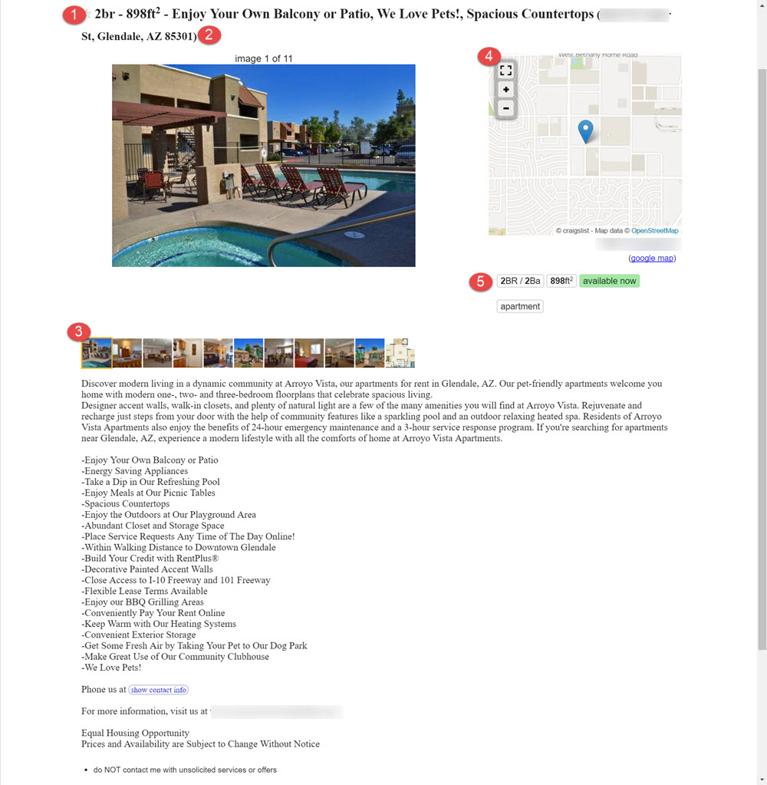

# Anatomy of a Post
This section will break down a Craigslist ad piece by piece and display where the information ends up on the ad.

##Finished Ad

1. **Posting Title** - Rooof generates titles by randomly selecting three amenities.
2. **Location** - From the information Rooof pulls, the parentheses shows the specific location in a city. This may be the street address for the property, or a community within the city that people may search for.
3. **Map** - The map features a pin dropped at the property location. Rooof pulls this information from your website.
4. **Posting Details** - This displays critical information about the unit that will interest most viewers.
5. **Photos** - Rooof pulls photos from the property website and puts them in random order (except the floorplan, which is always last).
6. **Body Text** - This text is pulled from the property website and gives the viewer information about the property.