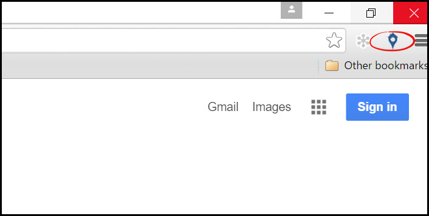
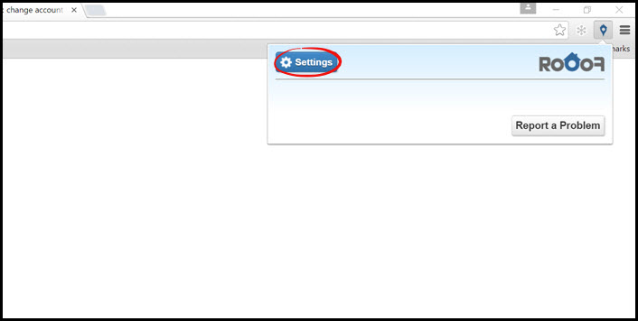
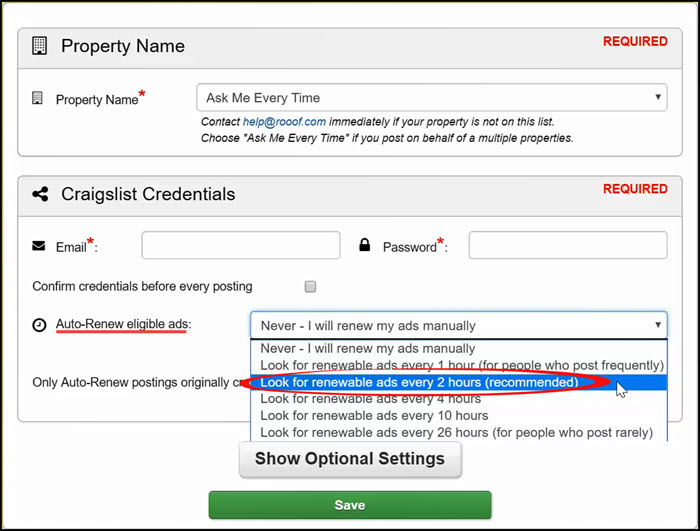

#Auto-Renew

##What is Ad Renewal?
When you initially post your ad, it is at the top on the first page of ad listings. As other people post ads, your ads get pushed further down the page, and eventually on to the next pages. After 48 hours, your ad is eligible to be renewed. When it is renewed, it is placed back at the top of the ad listings.

Renewing keeps your ads at the top of the page and ready to be seen by potential residents. Many viewers do not go past the first few pages of listings, and renewing makes sure your ads are seen by as many people as possible.

---

##Rooof Auto-Renewal
Rooof can do all your ad renewals for you! Once you change your settings, Rooof will periodically wake up and check for any ads eligible for renewal.

**Follow these steps to set you auto-renewal:**

1. **Click the Rooof icon** in the top right corner.

2. Click the "**Settings**" button

3. In the "**Auto-Renew eligible ads**" section, open the drop-box and select how often you want Rooof to check for renewable ads

**In order for auto-renewal to work, make sure you keep Chrome open. If you do not normally use the browser you can keep Chrome minimized to keep Rooof working in the background.**

---
**You may also find interesting:**
- [Optional Settings](http://docs.rooof.com/rooof_optional_settings.html)
- [Craigslist Lifecycle](http://docs.rooof.com/craigslistlifecycle_md.html)
- [Craigslist Problems](http://docs.rooof.com/craigslist_problems.html)

