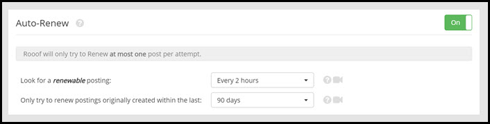
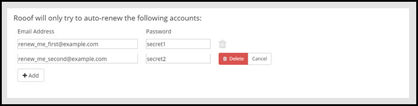
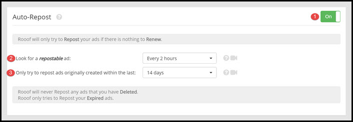

# Renew and Repost
##What is Ad Renewal?
When you initially post your ad, it is at the top on the first page of ad listings. As other people post ads, your ads get pushed further down the page, and eventually on to the next pages. After 48 hours, your ad is eligible to be renewed. When it is renewed, it is placed back at the top of the ad listings.

Renewing keeps your ads at the top of the page and ready to be seen by potential residents. Many viewers do not go past the first few pages of listings, and renewing makes sure your ads are seen by as many people as possible.
This page will explain the Auto-Renew and Auto-Repost settings.

---
##Auto-Renew

1. Toggle Auto-Renew on and off by clicking this button.
2. Choose how often you want Rooof to check for renewable ads. We recommend that you set this at "Every 2 hours" to get the best use of this feature.
3. Choose how long after the original posting date you want your ads to be renewed. For example: If you select "30 days" then Rooof will stop renewing an ad once it is 30 days old.

---
##Accounts
 

Enter the accounts that you want Rooof to check for renewals.
- To remove an account, click the **trash can** icon
- To add another line click the "**Add**" button
---
## Auto-Repost
Craigslist has a set lifetime for an ad. The length of time an ad stays posted for depends on the region. Once an ad has been up for the set amount of time it will expire and be removed. Craigslist gives you the opportunity to repost your ad. The Rooof auto-repost function will repost your ads for you.

1. Click this button to toggle Auto-Repost on and off
2. Choose how often you want Rooof to check for ads eligible for reposting. We recommend that you set this to "Every 2 hours"
3. Choose how long after the original posting date you want your ads to be reposted. For example: If you select "30 days" then Rooof will stop reposting an ad once it is 30 days old.