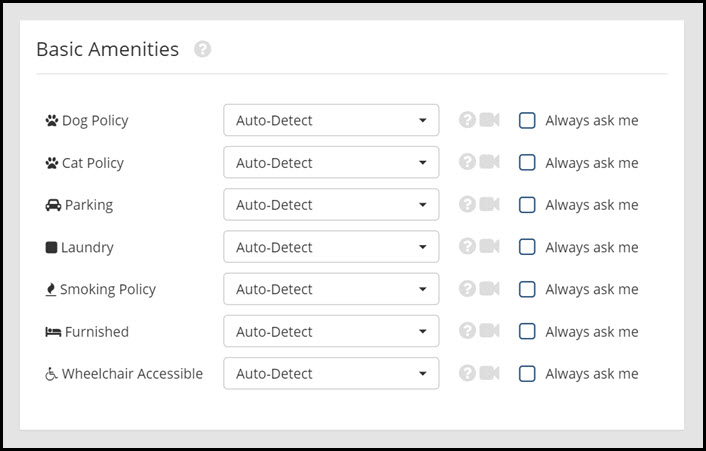

# Amenities

This page will explain the Amenities settings page.

When set to **"Auto-Detect"** Rooof will find this information on your property website (if available). If these options are always the same, you may wish to set them by using the drop-down box to select the applicable amenities.

By checking the "Always ask me" box, Rooof will ask you to confirm the amenity every time you post.