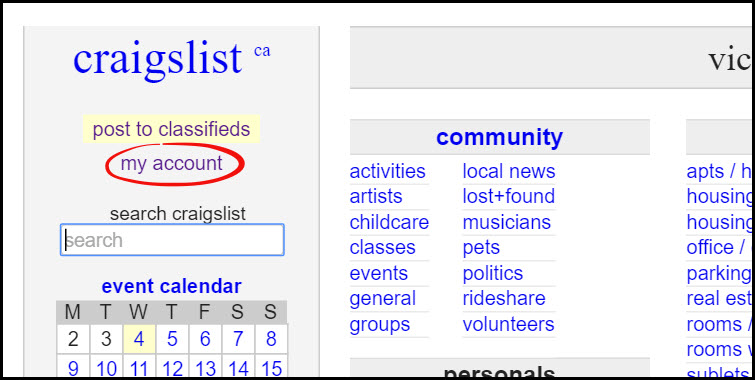
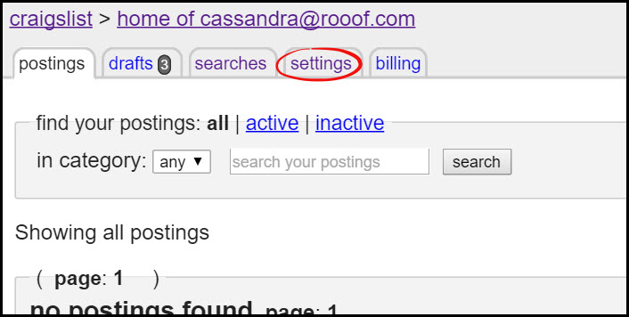
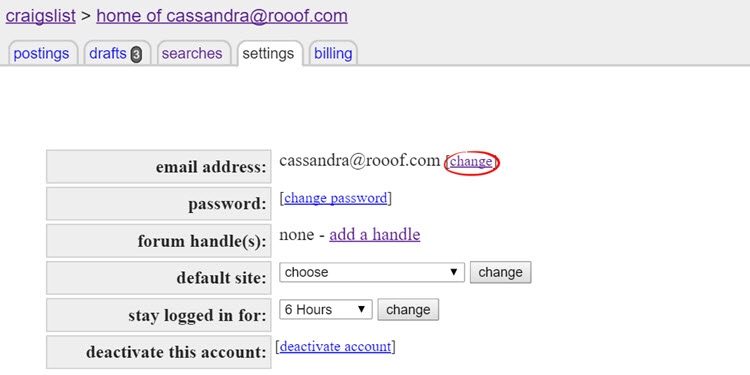
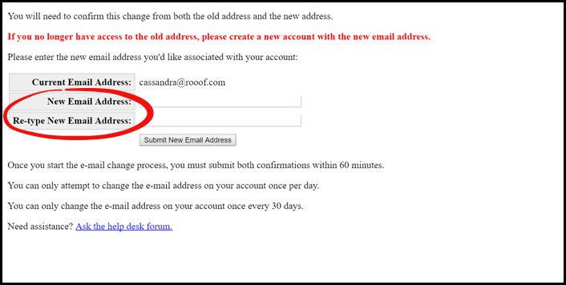
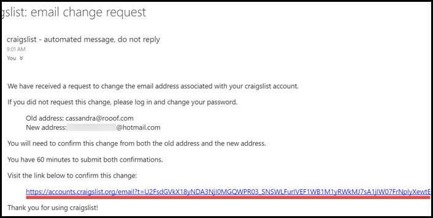
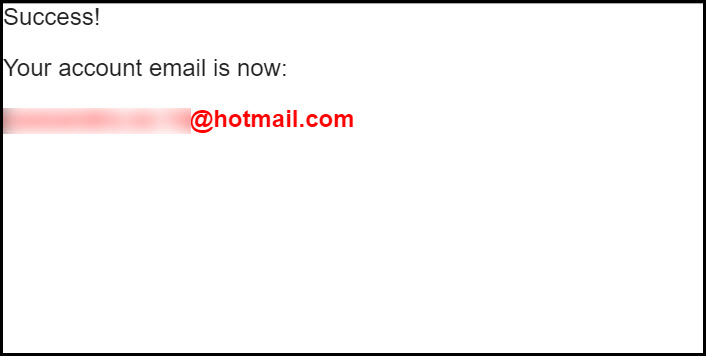
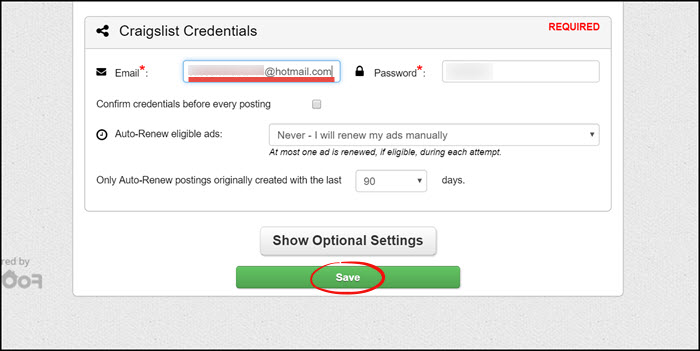

# Changing Your Craigslist Email Address

The following steps will show you how to change the email associated with your Craigslist account.
1. Sign in to Craigslist
2. Click "My Account" on the left panel
 

3. Click the tab at the top left of the page labeled "settings"
 

4. This page will show your current email, click the "change" button beside it
 

5. It may need you to confirm your log in information
6. Enter the new email address and click "Submit New Email Address"
 

7. It will send confirmation links to the old email and the new email.
    - Go to your email and open the message "email change request"
    - In this email there will be a link, click the link to confirm the email change
    - Repeat these steps in your other email
 

8. When you have confirmed the email change from both emails, the page will tell you the change was successful
 

9. Click the Rooof icon in the top right corner of Google Chrome and click the "Settings" button
 

10. In the  Craigslist Credentials section, type the new email into the box and click save

**Your email is now updated!**