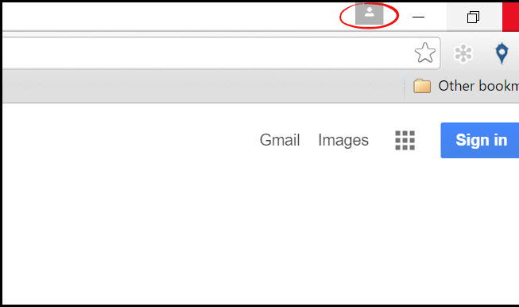
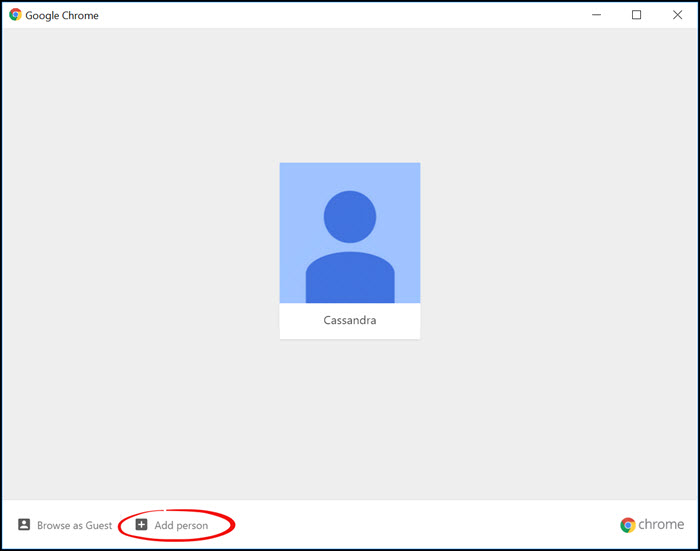
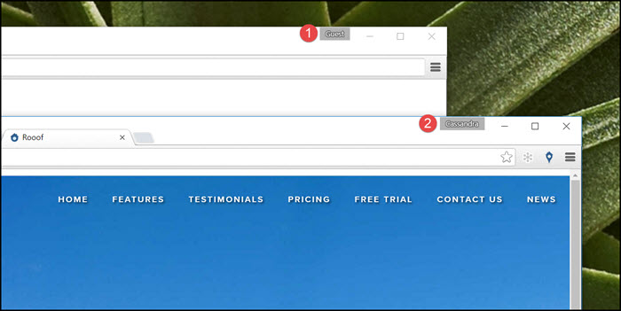

# Using Multiple Chrome Profiles

If you use the same computer to post for multiple properties, you should have a Craigslist account for each property. This page will show you how to switch between the two accounts by using Chrome profiles.

Follow these instructions:
1. Open the Google Chrome browser
2. If you are logged in to Chrome, click the button with your name in the top right corner
 
If you are not logged in you will see a small icon of a person. Click this and enter your credentials to log in to Chrome.

3. Click the "**Switch Person**" button
 

4. If there is already another profile logged in to Chrome, it will show beside yours. If not, then click "**Add Account**" at the bottom of the page. This will allow you to create a new profile to use in Chrome.
 

5. Now you have two Chrome screens open, allowing you to work from two different accounts at the same time

---

**You may also be interested in:**
- [Craigslist Problems](http://docs.rooof.com/craigslist_problems.html)
- [Optional Settings](http://docs.rooof.com/rooof_optional_settings.html)
- [Installing Google Chrome](http://docs.rooof.com/installing_google_chrome.html)
