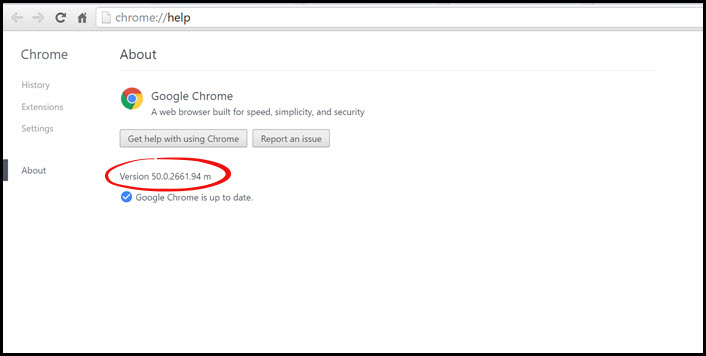

# Checking Chrome Browser Version

This page will help you determine what version of Google Chrome you have.

Follow these steps:

1. Open your Google Chrome browser
2. In the top right corner, click the icon with the three bars called "Customize and control Google Chrome"
 

3. Open the "Help" menu, and click "About Google Chrome"  

4. The "About Google Chrome" page will show you the version number that you are and will also tell you if it is up to date

