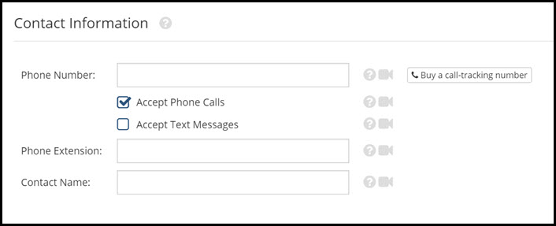

# Contact
This page will explain the Contact settings.

When left blank, Rooof will pull your contact information from your property website. If you want to display different contact information from what is on your website, enter it here. This section is helpful if you use a lead-tracking number for your ads.

Enter your phone number, phone extension (if applicable), and contact name. The information entered will be put on every ad you post. Check or un-check the boxes to accept, or not accept phone calls or text messages. If you leave both boxes unchecked, respondents will only be able to contact you by email.