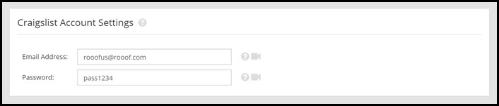
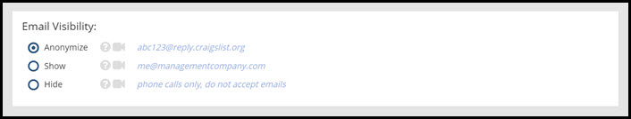
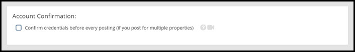

# Credentials

This page will explain the Credentials settings page.

##Craigslist Credentials

Enter your Craigslist email address and password to allow Rooof to log in to your Craigslist account.

---

##Email Visibility

**Anonymize** - Craigslist will create a random email to show when viewers respond to your ads. This option is recommended because it can help cut down on ghosting and flagging.

**Show** - Craigslist will show your actual email to people responding to your ads.

**Hide** - Craigslist will not allow people to contact you by email to respond to ads. Responding by phone will be the only option available.

---

##Account Confirmation

Check this box if you post for more than one property. When checked,  Rooof will ask you each time you post to confirm what Craigslist credentials you want to use to post your ad.