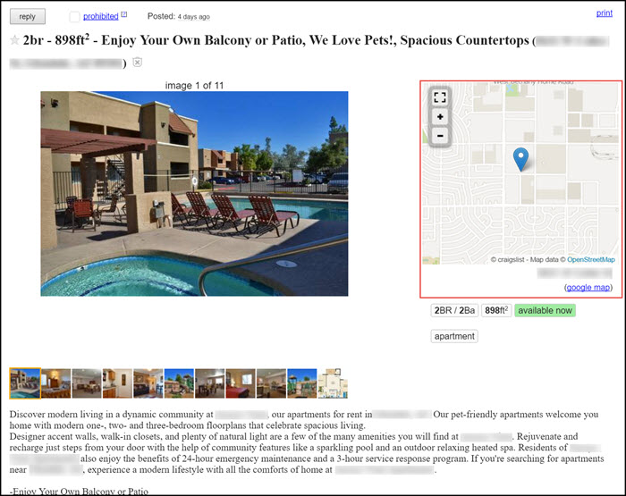
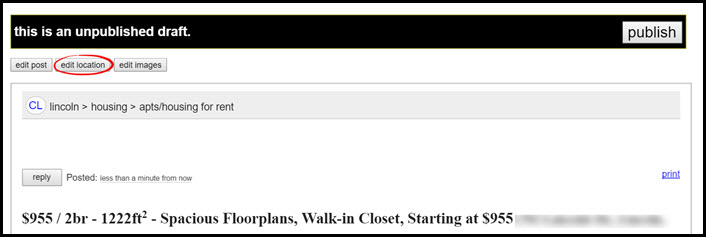
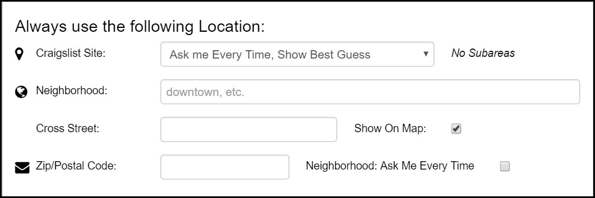

# Mapping
This page will show the mapping features of Craigslist, and how Rooof interacts with these features.

When you post an ad to Craigslist, the property location is placed on a map. This helps potential residents see what area the property is in within the city. 
 

A pin point is placed on your map based on the information that Rooof pulls from your property website.

**There are two ways to change the locations in your posting:**
1. Edit the draft posting. Once Rooof gives you the unpublished draft version of your ad, click "Edit Location".
 

Once on the next page, you can click and drag the pinpoint to change the map location. You can also edit the street address, city, and postal code. When you are finished, click "continue".

2. Set your Rooof settings to remember your location. Click the Rooof icon in the top right corner, then "Settings".

Once your are in the settings page, click the "Show Optional Settings" button.

Scroll down to the location settings. Here you can set Rooof to always use the same Craigslist site, neighborhood, cross street, or postal code.
