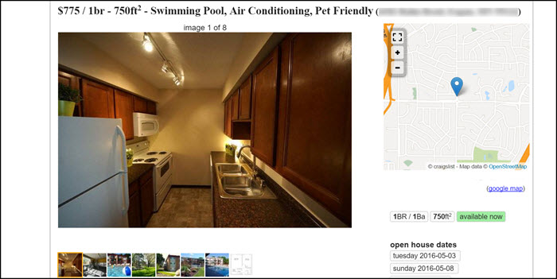
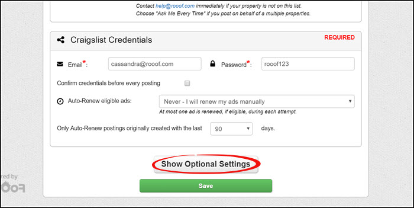
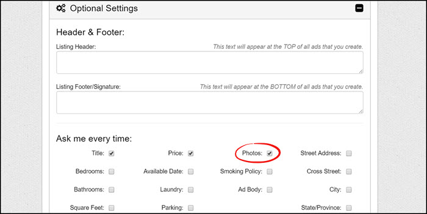
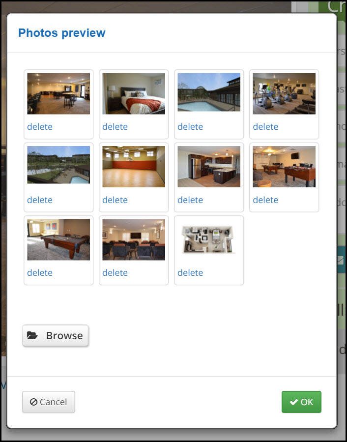

# Images/Photos
##Photos in Ad
When you add photos to your ad, they will be displayed like this...
 
The first photo will be displayed large as the feature photo. The rest of the photos are shown as thumbnails for viewers to scroll through.

##Rooof Photo Settings
Roof automactically pulls photos from your website to put in your ad. The photos are always in random order, except the layout always being last. In each photo, Rooof changes one pixel but this cannot be seen by the human eye. Both of these features help cut down on flagging. If you would like to review and change the photos, follow these instructions:

1. Click the Rooof icon at the top right corner of Google Chrome, and click the "Settings" button
 

2. Click the "Show Optional Settings" button
 

3. In the "Ask me every time" section, check the "Photos" box
 

Now, when you go to post an ad using Rooof, it give you a photos preview. The pop up looks like this...

- The first photo shown will be the featured photo for the ad
- Click and drag photos to change the order (keep in mind that random photo order cuts down on flagging)
- If you want to delete a photo, click "delete"
- If you want to add more photos, click "Browse" and select the photo from your computer
- When you are happy with the photos, click the green "OK" button