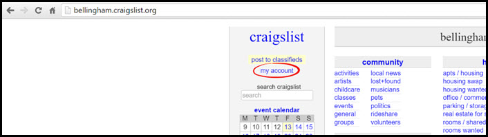
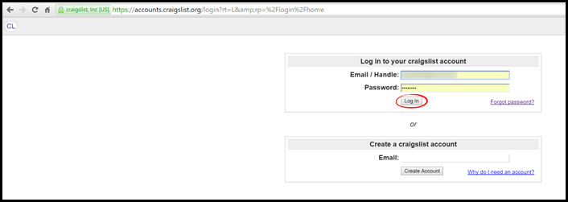
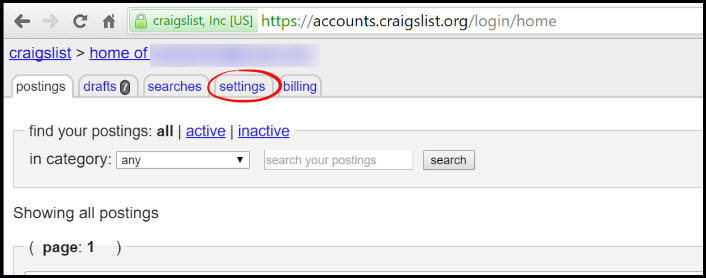
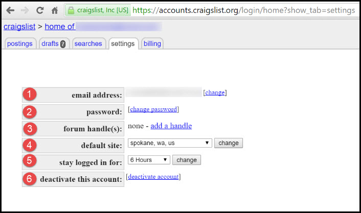

# Craigslist Settings
This page explains the settings page of your Craigslist account.

 
**To get to your settings page, follow these instructions:**
1. Go to [craigslist.org](craigslist.org)
2. Click "**My Account**" on the left side panel

3. Enter your Craigslist credentials and click "**Log In**"

4. Click the "**Settings**" tab at the top of the page

---
##Settings Options

1. **Email Address** - this shows you the current email associated with your account. 
2. **Password** - Click "**change password**" to change your password.  
3. **Forum Handle** - If you want to be identified by a unique handle, click "**add a handle**". This will be displayed if you post on forums on Craigslist. 
4. **Default Site** - If you have one city you are posting from you can choose to set a default site to save time selecting a city when posting. 
5. **Stay Logged in For** - Use the drop down menu to choose how long you remained logged into your account. This ranges from 15 minutes to one week.  
6. **Deactivate This Account** - If you want to deactivate your Craigslist account, click "**deactivate account**".

---
**You may also be interested in:**
- [Resetting your Password](http://docs.rooof.com/resetcraigslist_password_md.html)
- [Changing Craigslist Email](http://docs.rooof.com/changecraigslist_email_md.html)
- [Log In to Craigslist](http://docs.rooof.com/loginto_craigslist_md.html)