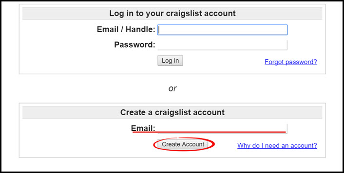
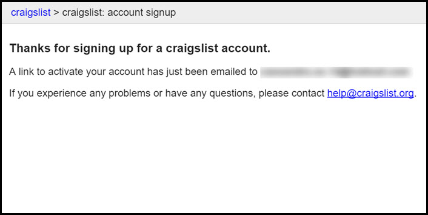
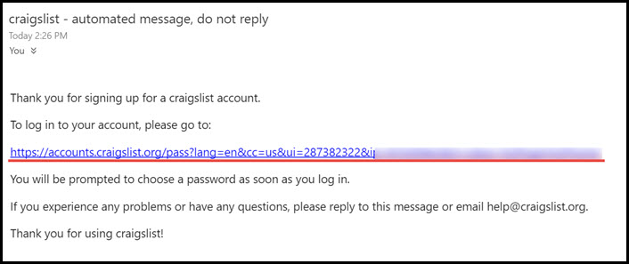
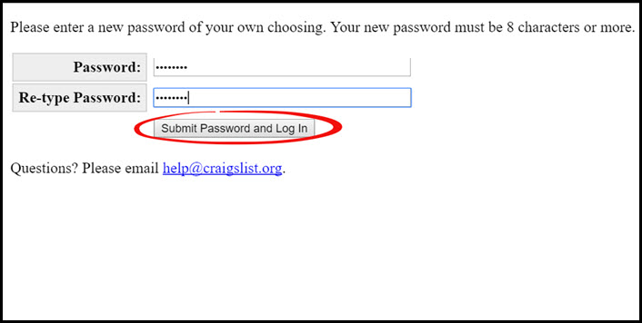
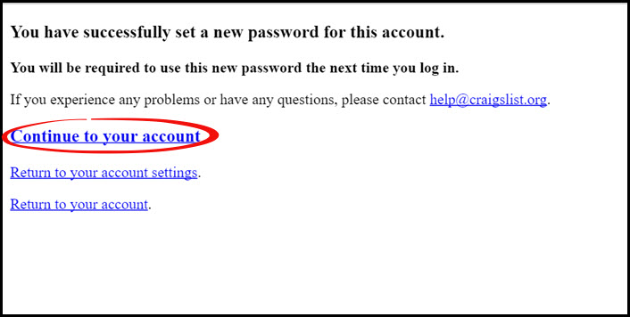
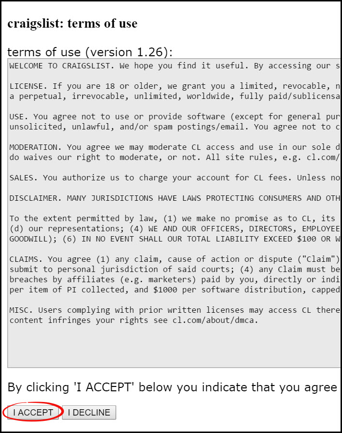

# Create Craigslist Account
This page will explain how to create a new account on Craigslist.

**To create a Craigslist account, follow these steps:**
1. Go to [craigslist.org](craigslist.org) and on the left side panel, click "**my account**"

2. In the "**Create a craigslist account**" box, enter your email and click "**Create Account**"

3. An activation email will be sent to the email you entered

4. Check your email and click the link provided
 
*If you did not recieve an email, make sure you check your junk folder.

5. Enter a password for your new account and click "**Submit Password and Log In**"

6. When it confirms your password, click "**Continue to your account**"

7. Read and click "**I ACCEPT**" to finalize your new account

**You are now ready to start using your new Craigslist account!**

---

**You may also be interested in:**
- [Log In to Craigslist](http://docs.rooof.com/loginto_craigslist_md.html)
- [Craigslist Best Practices](http://docs.rooof.com/craigslistbest_practices_md.html)
- [Installing Google Chrome](http://docs.rooof.com/installing_google_chrome.html)