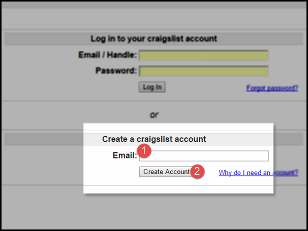
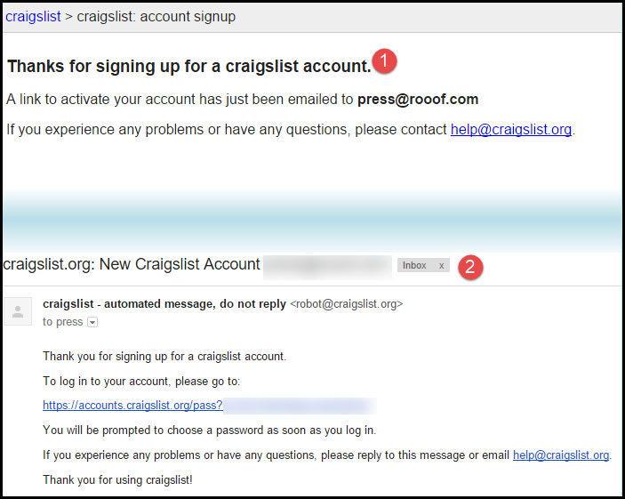
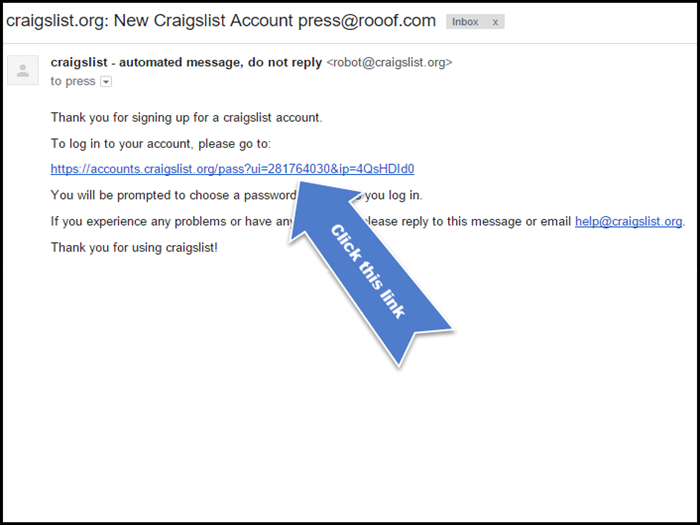

# Create Craigslist Account v2

####1. To create a Craigslist account, go to craigslist.org (or "yourregion".craigslist.org), and click on the account option.

 
####2. Enter your email address in the text field under "Create a Craigslist account" and then click "Create an Account."

 
 
####3. You will be taken to the confirmation screen (1) and receive a "New Craigslist Account" confirmation email (2). 

  

####4. Login to the email account that was used to create the Craigslist account, and click on the confirmation link within the email. 

