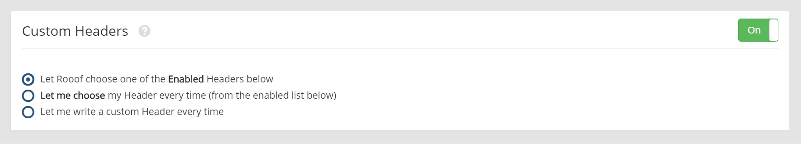
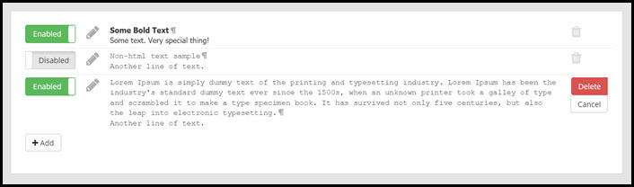

# Custom Headers/Footers
This page will explain the headers and footers settings page.

The custom headers/footers section allows you to enter text that will appear at the top or bottom of all your ads.

**Let Rooof choose one of the enabled headers below** - This option will cycle through your *enabled* custom headers. 
**Let me choose my header every time** - This option will allow you to choose from your list of your custom headers each time you post an ad. 
**Let me write a custom header every time** - This option will prompt you to write a header each time you post an ad.

---

Click the "**Enabled/Disabled**" buttons to toggle the options. When a header is set to "**Disabled**" it will not be put in to the rotation of headers to be used. This option is helpful if you have a header that you use frequently, but not all the time.

Click the **pencil icon** next to a header to edit.

Click the **trash can **to the right of a header to completely delete the corresponding header.