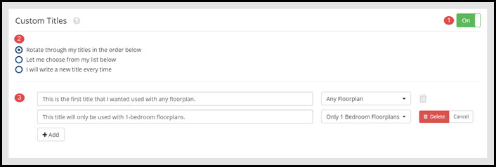

# Titles

This page will explain the Custom Titles settings.

1. Click this button to toggle the custom titles settings on and off. When set to "**Off**", Rooof will generate custom, unique titles based on the property amenities.

2. These options allow you to choose how you use the custom title settings. 
**Rotate through my titles in the order below** - This option will cycle through the custom titles you have written below. 
**Let me choose from my list below** - This option will allow you to choose from the list of your custom titles each time you post an ad. 
**I will write a new title every time** - This option will prompt you to write a title each time you post an ad.

3. Write your custom titles in these fields. Click the "**Add**" button to add a new line. If you want the title to only be used when posting a specific floorplan, select the floorplan in the dropdown menu on the right.

**Note:** We strongly recommend to use the titles that Rooof generates. Using our titles creates ad variability, which cuts down on Craigslist ghosting and flagging. If you choose to use custom titles, be sure to provide a large amount of titles to choose from. If you are writing your own titles for each ad, try to make them different each time to avoid having your ads taken down.