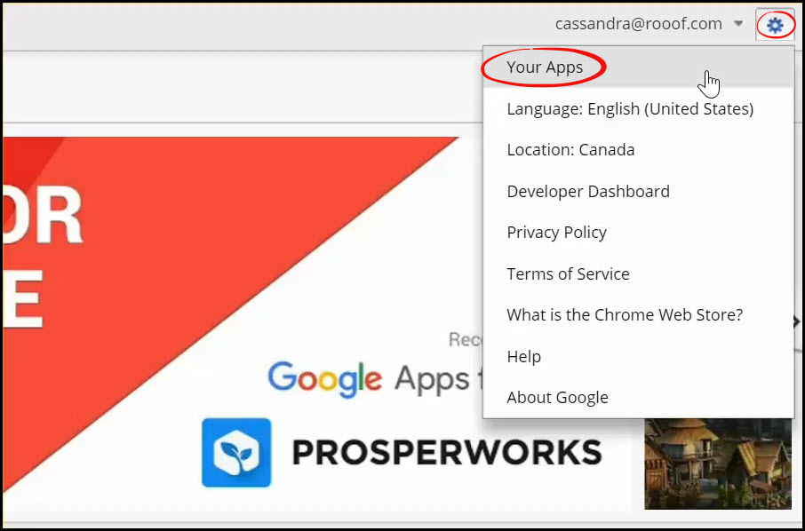
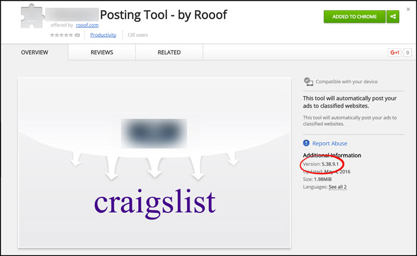

# Checking Chrome Extension Versions

This page will show you how to check the version of your Chrome extensions.

**Follow these instructions:**

1. Open your Google Chrome browser
2. Go to the Chrome Webstore - [Click Here](https://chrome.google.com/webstore/category/apps)
3. If you are signed in, you will see your email at the top right corner. If you are not already signed in, click "Sign In" in the top right corner and enter your credentials.
4. When you are signed in, click on the settings button at the top right corner (a gear), and then click "Your Apps".
 

5. Find the extension that you would like to know the version of. Click the green "Added to Chrome" button.

6. The version number is listed in the bottom right of the window.

---
**You may also find interesting**
- [Updating Chrome Extensions](http://docs.rooof.com/updatingextensions_md.html)
- [Opening Rooof Settings](http://docs.rooof.com/openingsettings_md.html)
- [Create Craigslist Account](http://docs.rooof.com/create_craigslist_account.html)
