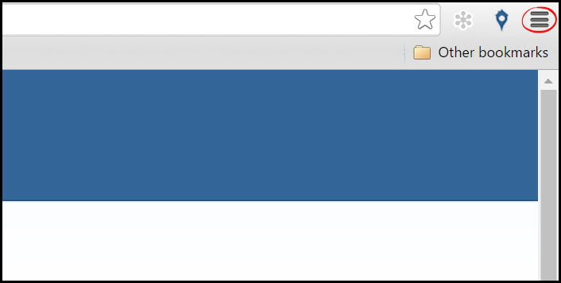
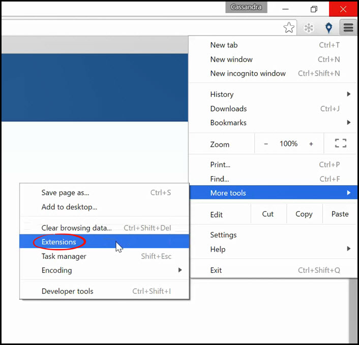
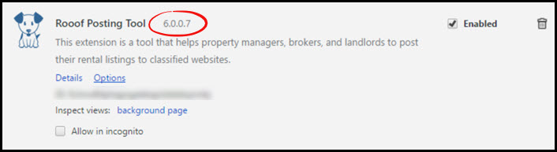

# Checking Chrome Extension Versions

This page will show you how to check the version of your Chrome extensions.

**Follow these instructions:**

1. Open your Google Chrome browser
2. Click the menu button in the top right corner of your browser

3. In the "**More Tools**" menu, click "**Extensions**"

4. Find the extension you want to check, and the version number is listed beside the title.

---
**You may also find interesting**
- [Updating Chrome Extensions](http://docs.rooof.com/updatingextensions_md.html)
- [Opening Rooof Settings](http://docs.rooof.com/openingsettings_md.html)
- [Create Craigslist Account](http://docs.rooof.com/create_craigslist_account.html)
