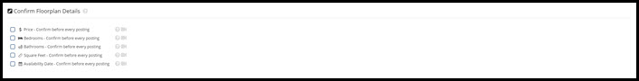
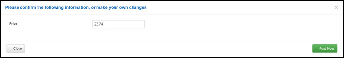

# Floorplans

This page will explain the Floorplans settings page.

Check the boxes if you would like to confirm the associated information before Rooof creates your post.

 
 

**Example:** If you check the "**Price**" box, you will get a pop-up after you click "**Post Now**"...

From here you are able to edit the price. Once you are happy, click the green "**Post Now**" button to continue.