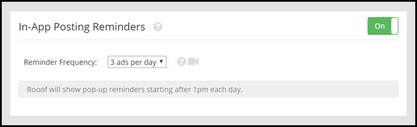
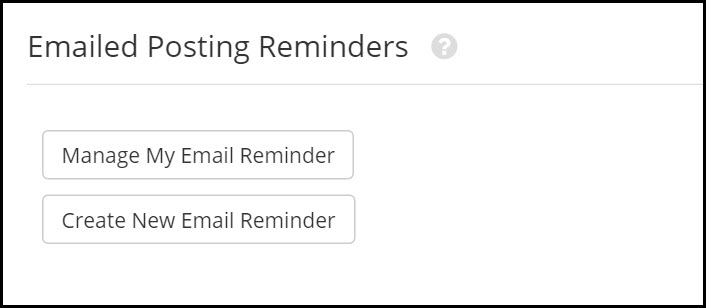

# Reminders

##Over-Posting Protection
It is important to space out your posts throughout the day. If you post your ads too close together, they may be ghosted or flagged by Craigslist and be removed. Over-posting protection will help remind you to leave time between ads.

The "**Minimum time between ads**" will determine the amount of time after posting an ad that we will remind you not to over-post. We recommend setting this at least one hour between posts, depending on how many times you post each day.

When a over-posting protection pop-up appears, you are able to bypass the warning and post anyways.

---
## In-App Posting Reminders

Rooof offers in-app reminders to post. These are especially helpful if you need to post a certain number of times each day.

Click the button to toggle between on and off.

Set the reminder frequency to how many times a day you need to post. The reminders will pop up in the bottom right corner of your screen. This setting also ensures that your ads are posted throughout the day, which cuts down on ghosting and flagging. Spreading out your posts also ensures that a wide variety of viewers are seeing your ads.

---

## Email Reminders
When you turn on email reminders, Rooof will email you at set intervals throughout the day to remind you to post. For example, if you want to post three times a day you can set a reminder to be emailed at 10:00, 1:00, and 3:00. The reminders have links to your property website's floorplan page, which makes it nice and easy to post an ad. 

If you want to make changes to an existing reminder, click "**Manage My Email Reminder**". 
If you want to create a new email reminder, click "**Create New Email Reminder**".