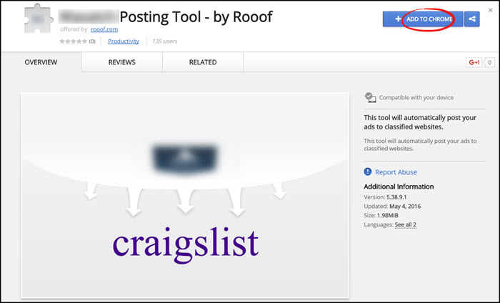
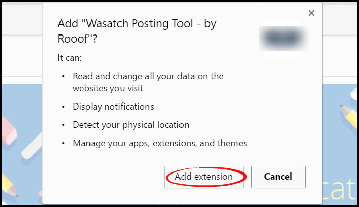
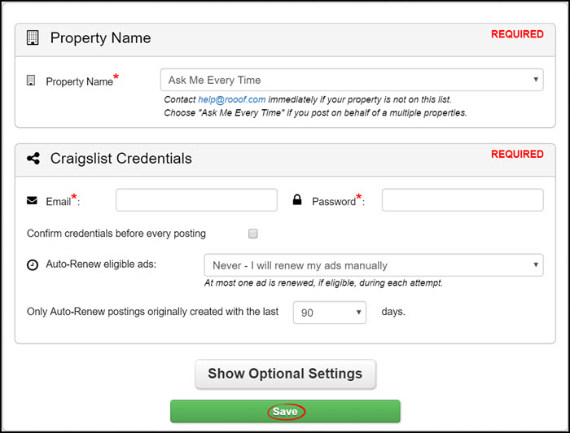
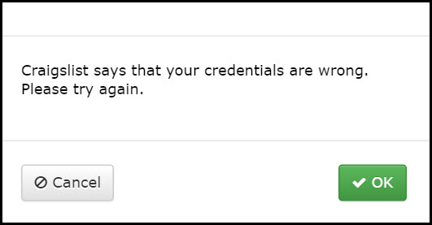

# Install Extension
This page will tell you how to install your Rooof posting tool to Google Chrome.

**Follow these instructions:**
1. Open Google Chrome
2. Click on the Chrome Webstore link provided by your Rooof representative (let us know if you need this link again)
3. Click the blue "**Add to Chrome**" button
 

4. A box will pop up giving you information about the extension, and asking your permission to install. Click "**Add Extension**".
 

5. The extension will then be installed. When finished, Chrome will automatically open a new tab on the settings page of your posting tool. Enter your Craigslist credentials and click "**Save**".

After you click "**Save**", Rooof will check your Craigslist credentials. You will see pop-ups in the bottom right corner - this is the posting tool working. You will be able to see Rooof working right before your eyes. Try not to click in the tab where Rooof is working but feel free to work in other tabs while you wait. A pop-up will notify you when it is done.

Note: If you enter incorrect credentials, you will get this message...
 
If this happens, click "**OK**" and do the following:
* Check that you entered your credentials correctly, or
* Reset your password

---
**You may also be interested in:**
- [Checking Chrome Extension Versions](http://docs.rooof.com/extensionversions_md.html)
- [Updating Chrome Extensions](http://docs.rooof.com/updatingextensions_md.html)
- [Password Reset](http://docs.rooof.com/resetcraigslist_password_md.html)

