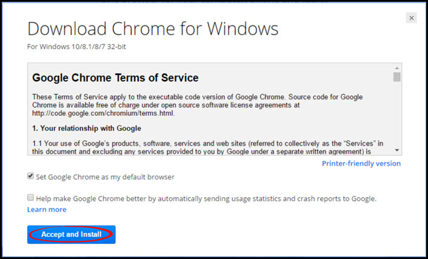
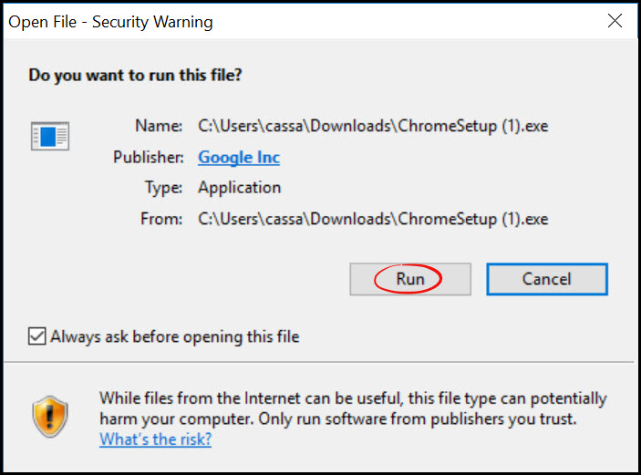
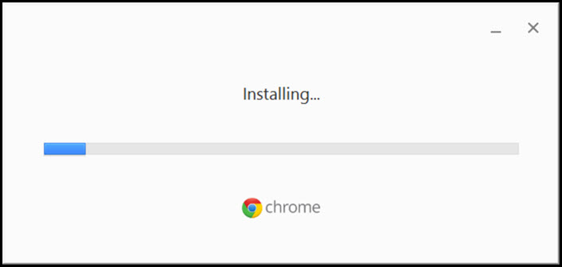

# Installing Google Chrome
Google Chrome is a web browser similar to Firefox or Internet Explorer. You must be using Google Chrome for the Rooof posting tool to work. This page will explain how to download and install Google Chrome.

**To download and install the Google Chrome browser, follow these steps:**

1. Click [here](https://www.google.com/chrome/browser/desktop/index.html) to go to the download page for Google Chrome.
2. Click the blue "**Download Chrome**" button

3. Read the terms of service and click "**Accept and Install**"

4. Once the file has finished downloading in your browser, click it to open. Then click the "**Run**" button on the pop up.

5. A box may appear asking if you want to allow the program to make changes to your computer. If this happens, click "**Yes**"
6. Google Chrome will now download and install on your computer

**You have now installed Google Chrome!**

To start Chrome:
* Windows 7/Vista: A Chrome window opens once everything is set up.

* Windows 8: A welcome dialog appears, click Next to select your default browser. If you choose Google Chrome, it'll launch as a Windows 8 app from the Start Screen.

---
**You may also be interested in:**
- [Running Chrome](http://docs.rooof.com/runningchrome_md.html)
- [Restarting Chrome](http://docs.rooof.com/restartingchrome_md.html)
- [Install Extension](http://docs.rooof.com/installchrome_extension_md.html)
