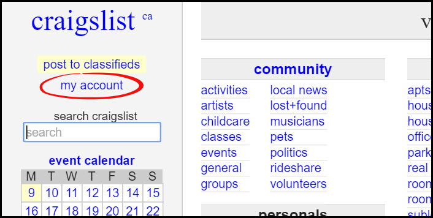
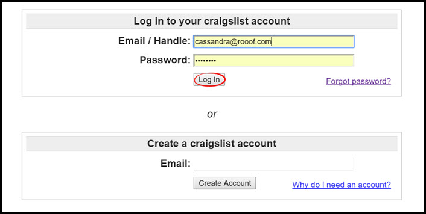
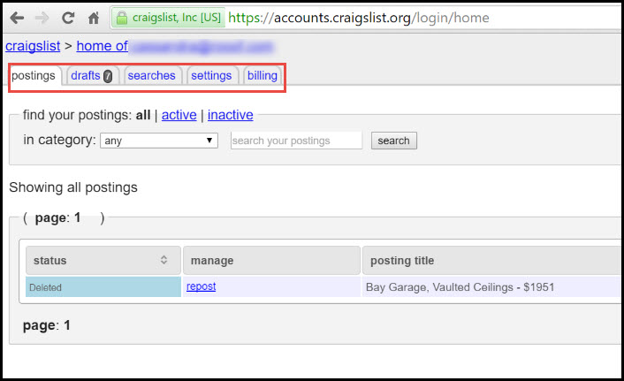
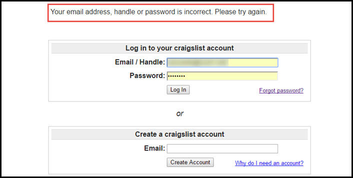

# Log In to Craigslist
This page will explain how to log in to your Craigslist account.

1. Go to [craigslist.org](craigslist.org) and on the left side panel click "**my account**"

2. Enter your Craigslist credentials and click "**Log In**"

**If the log in is successful**, you will be brought to the "My Account" page...
 

From here you can access your postings, drafts, searches, settings, and billing pages.

**If the log in fails**, it will give you an error message and ask you to try again. 
 
If you need to reset your password, click the "Forgot Password?" button. If you need help resetting your password, click [this link](http://docs.rooof.com/resetcraigslist_password_md.html) for instructions.

---

**You may also be interested in:**
- [Craigslist Best Practices](http://docs.rooof.com/craigslistbest_practices_md.html)
- [Craigslist Life Cycle](http://docs.rooof.com/craigslistlifecycle_md.html)
- [Craigslist Settings](http://docs.rooof.com/craigslistsetting_md.html)
