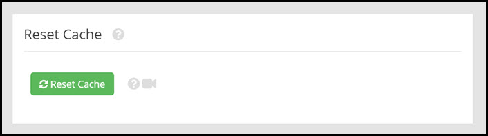
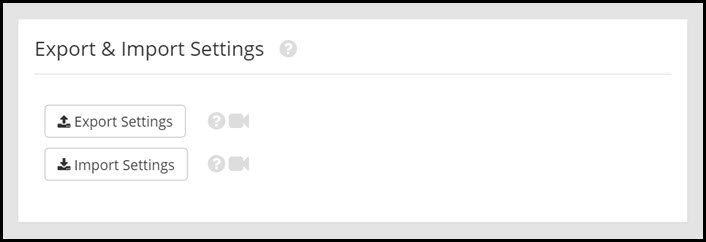

# Maintenance

This page will explain the maintenance settings.

##Clear Cache

If you need to clear your cache, click "**Clear Cache**".

---

##Export & Import Settings

To export the current settings saved in your Rooof posting tool, click "**Export Settings**".

To import settings from a saved export file, click "**Import Settings**". This will program the settings from the file to your posting tool.

---

##Install This Posting Tool on a Different Computer

---

##Serial Number