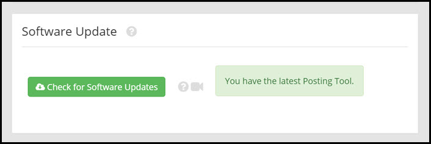

# Maintenance

This page will explain the maintenance settings.

##Clear Cache

If you need to clear your cache, click "**Clear Cache**".

---

##Software Update
This menu allows you to check if your Rooof posting tool is up to date.

Click "**Check for Software Updates**" to check the version of your posting tool and determine if it is the latest version.

If your posting tool is out of date, click the button to update.

It is important to have the latest version of the posting tool to ensure that Rooof works properly.

---
##Export & Import Settings

To export the current settings saved in your Rooof posting tool, click "**Export Settings**".

To import settings from a saved export file, click "**Import Settings**". This will program the settings from the file to your posting tool.

---

##Install This Posting Tool on a Different Computer

---

##Serial Number