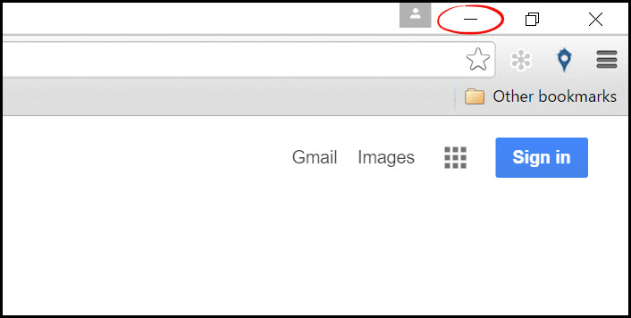

# Minimizing

For Rooof to run, Chrome must be running. If you are not actively using Chrome, minimizing allows Rooof to run in the background even if you are not using Chrome.

Follow these instructions to minimize Chrome:
1. Have Google Chrome open
2. In the top right corner of Chrome, click the minimize button (the small line)

You can tell that Chrome is still running in the background by the blue line under the icon in the taskbar. 

**To keep Rooof active checking your ads for renewals, make sure that you keep Chrome open.**

---

**You may also be interested in:**
- [Restarting Chrome](http://docs.rooof.com/restartingchrome_md.html)
- [Updating Chrome](http://docs.rooof.com/updatingchrome_md.html)
- [Auto-Renew](http://docs.rooof.com/auto-renew.html)