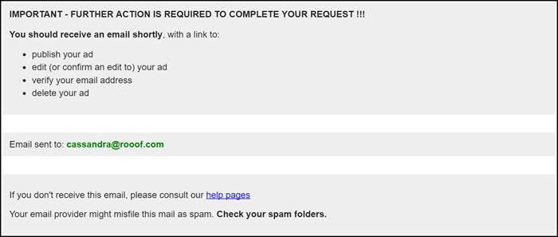
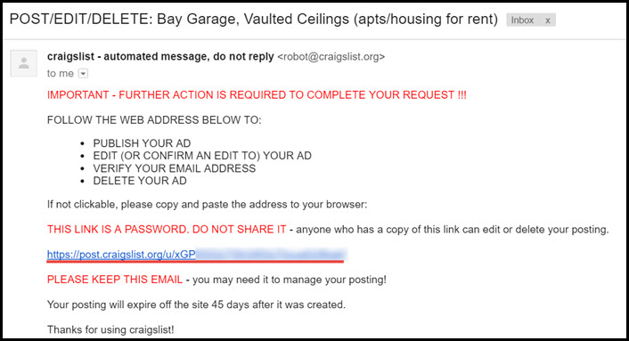
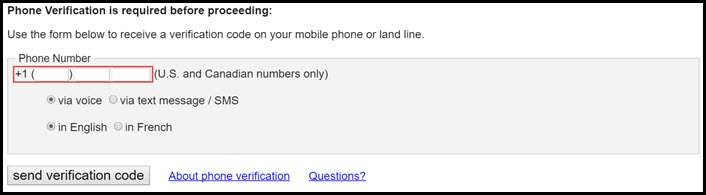
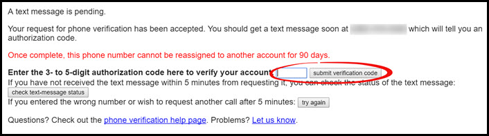

# Phone Verification
This page will explain the phone verification process.

Once you hit "**Publish**" Craigslist may need you to confirm the ad through phone verification. This generally happens in the first month of using an account, but may happen past this point. If you publish an ad and it is not showing, check your email for a verification notification email.

If so, this is the page you will see after you click "**Publish**" on your ad.

**If you get this message, follow these steps:**
1. Go to your email
2. Check for an email from Craigslist with the subject "**POST/EDIT/DELETE**"
   - If you do not see it, check your junk folder
3. Click the link in the email

4. Enter your phone number and choose voice or text to receive a verification code. Click "**Send Verification Code**" when you are ready. 

5. You will shortly receive a verification code. Enter it in the box and click "**submit verification code**"

**Your post is now published!**

---
**You may also be interested in:**
- [Logging in to Craigslist](http://docs.rooof.com/loginto_craigslist_md.html)
- [Finding your Posted Ads](http://docs.rooof.com/findingyour_posted_ads_md.html)
- [Craigslist Problems](http://docs.rooof.com/craigslist_problems.html)
