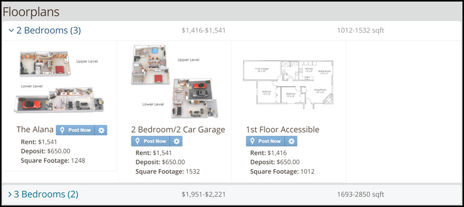

# Posting Button
This page explains how to access the Rooof posting tool on your property website.

**Follow these steps:**
1. In Google Chrome, navigate to your property website and on to the floorplan page
2. Next to each floorplan, there should be a blue "**Post Now**" button

3. To post an ad, click "**Post Now**" and Rooof will start

**If you do not see these buttons, check the following things:**
- You are using Google Chrome
- You have the Rooof posting tool Chrome extension installed (it must be installed on each computer you want to post from)
- You are on the correct property website

---
**You may also find interesting:**
- [Finding your Website/Floorplans](http://docs.rooof.com/findingfloorplan_md.html)
- [Opening Settings](http://docs.rooof.com/openingsettings_md.html)
- [Optional Settings](http://docs.rooof.com/rooof_optional_settings.html)
