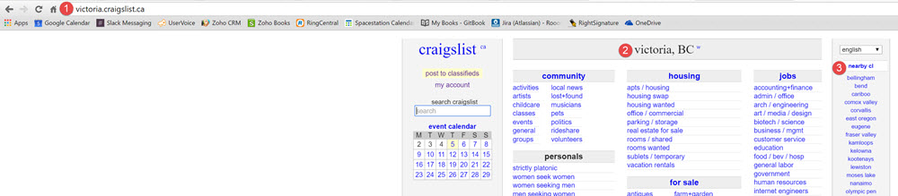
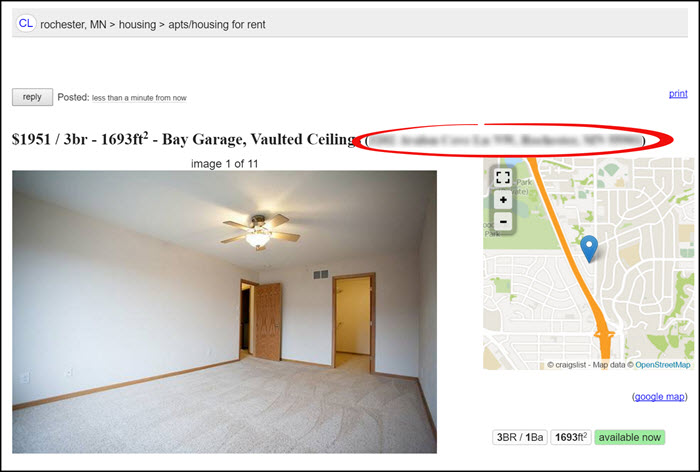

# Regions & Neighborhoods
This page will explain the region and neighborhood settings of Craigslist.

##Regions
Regions are the area-specific Craigslist site that you post on.

1. In the URL, you can see that the region is set to Bellingham. To go directly to a regional Craigslist page you can type [your region].cragslist.org
2. At the top of the home page it displays what region you are currently viewing
3. The right side panel shows nearby regions. Click on any of the regions to go to the corresponding Craigslist page.

---
##Neighborhoods
Neighborhoods are the smaller area within a region. The neighborhood shows up in parentheses after the title of each ad.

---
##Rooof Settings
If you consistently post from the same neighborhood and region you can tell Rooof to use the same information each time.

**Follow these steps:**
1. Click the Rooof icon in the top right corner of your Chrome browser and click "**Settings**"

2. Click the "**Show Optional Settings**" button

3. Scroll down to the location settings. Here you can set your location and neighborhood to be the same for every ad.

 - Select your region in the "**Craigslist Site**" area.
     - If there is a subarea available, select it if the box appears
 - Enter your neighborhood
     - This will be a searchable keyword and show up in the title brackets
 - You can also choose to set your cross street and zip/postal code

---

**You may also be interested in:**
- [Location on Map](http://docs.rooof.com/craigslistmapping_md.html)
- [Opening Settings](http://docs.rooof.com/openingsettings_md.html)
- [Optional Settings](http://docs.rooof.com/rooof_optional_settings.html)
