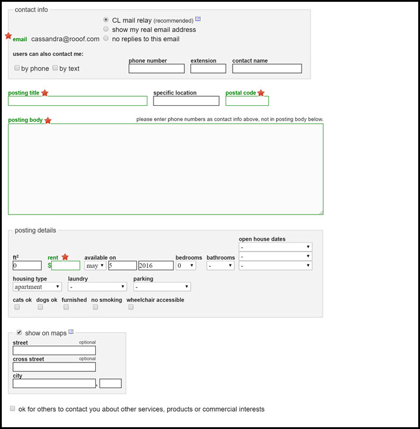

# Minimum Required Fields

Roof requires you to fill in certain fields based on what Craigslist requires to post an ad.

If you were posting a manual Craigslist ad, it would require you to have (at minimum) all the fields with a red star beside it.

When posting with Rooof, the posting tool looks for this information on the property website. If it cannot find it, it will pop up and ask you to fill in the information. In some cases, we have trained the posting tool to know what to put in these areas.

---

**You may also find interesting:**
- [Anatomy of a Post](http://docs.rooof.com/anatomymd.html)
- [Craigslist Lifecycle](http://docs.rooof.com/craigslistlifecycle_md.html)
- [Posting Button](http://docs.rooof.com/postingbutton_md.html)