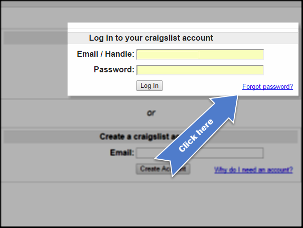
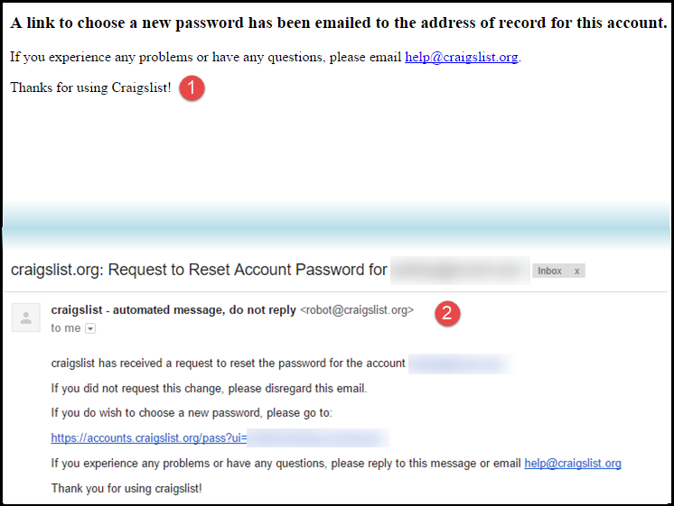
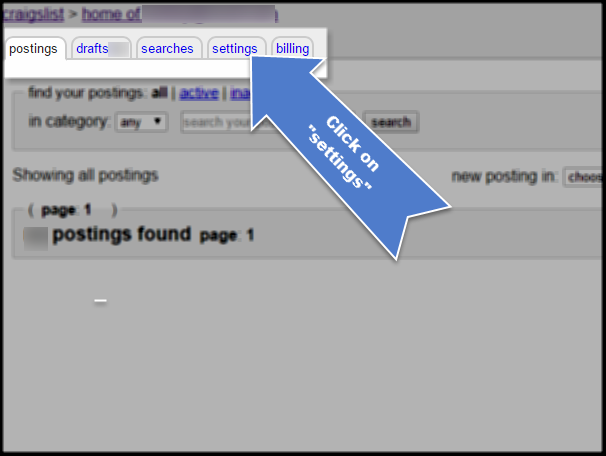

# Resetting your Password

Have you forgotten your password? If so, your Craigslist password can be reset through Craiglist's login page, and changed through the Craigslist account page. 

---

###Resetting Your Password 

####1. Go to Craigslist, and click on their login button.

  

####2. Next, click on "Forgot password?"

  

####3. Once you land on the reset password page, enter your Craigslist account email into the text field. Then, press "Reset Password." 

  

####4 You will be taken to a page like this (1), and receive an email with the reset link (2). 

  

---

###Changing Your Password

####1. Go to Craigslist, and click on their login button.

  

