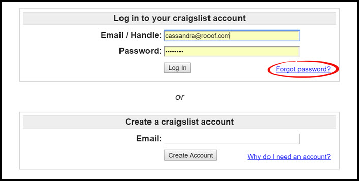
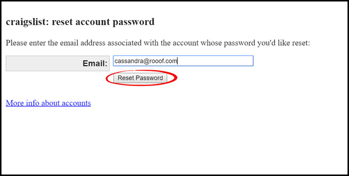
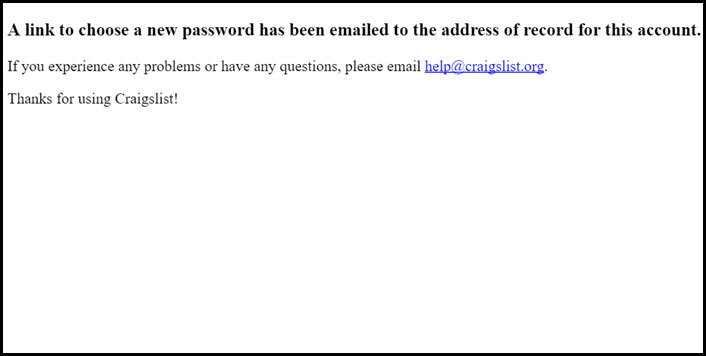
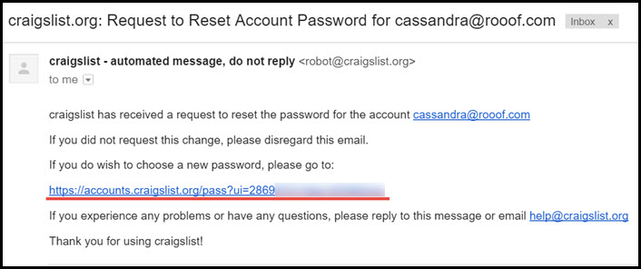
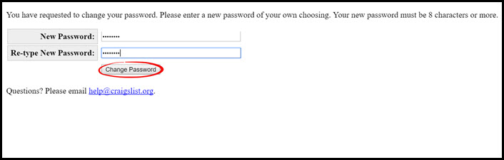
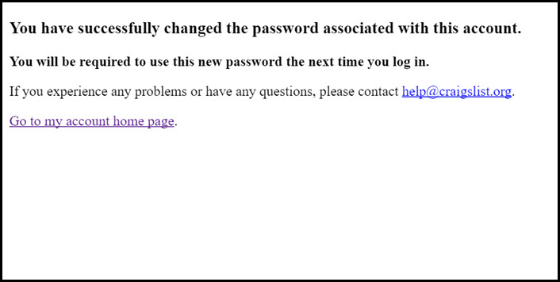
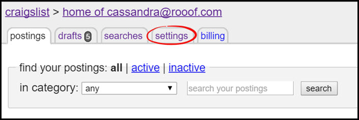
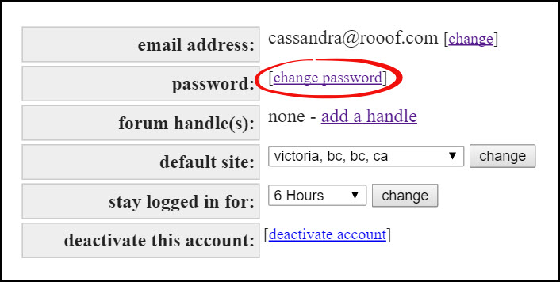
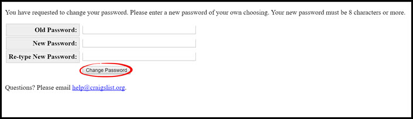

# Resetting your Password

This page gives you steps to change your password in two situations.

##Forgotten Password
**If you have forgotten your Craigslist password, follow these steps:**

1. Go to [craigslist.org](craigslist.org) and on the left panel click "**my account**"

2. Click the "**Forgot Password?**" button in the bottom right corner of the "**Log in to your craigslist account**"

3. Enter the email associated with your Craigslist account and click "**Reset Password**"

4. They will send a reset link to reset the password

5. Go to your email and click the link
 
*If you do not see an email, make sure you check your junk folder

6. Enter in a new password and click "**Change Password**"

7. You will get a message confirming the password reset

---

##Changing a Password

**To change your Craigslist password, follow these steps:**
1. Go to [craigslist.org](craigslist.org) and on the left side panel click "**my account**"

2. Enter your credentials and click "**Log In**"

3. Click the "**settings**" tab at the top left

4. Click the  "**change password**" button

5. Enter your existing password, then enter the new password you want and click "**Change Password**"

**Your password is now changed!**

---

**You may also be interested in:**
- [Changing your Craigslist Email](http://docs.rooof.com/changecraigslist_email_md.html)
- [Craigslist Settings](http://docs.rooof.com/craigslistsetting_md.html)
- [Craigslist Problems](http://docs.rooof.com/craigslist_problems.html)
