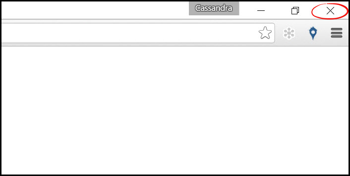
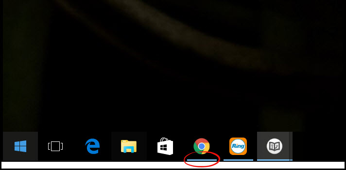
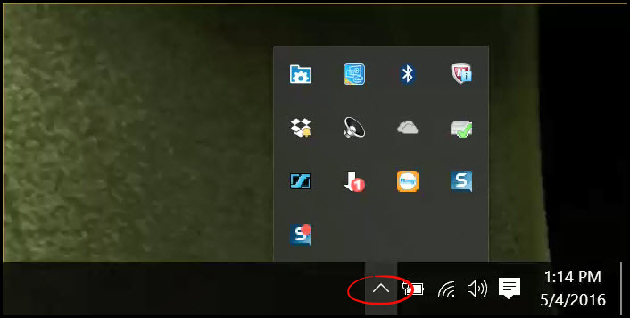
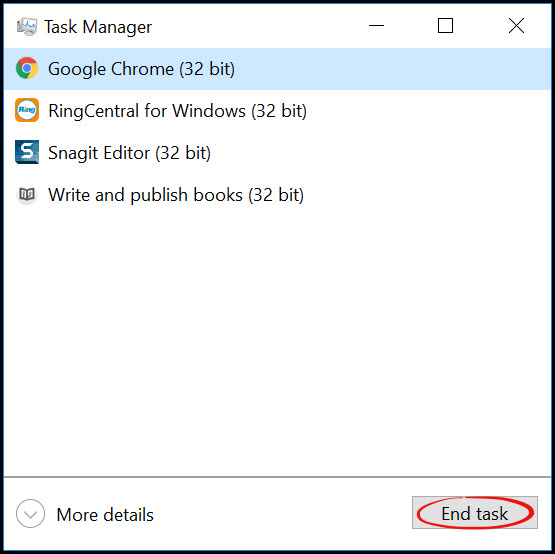

#Restarting
This page will tell you how to completely shut down Google Chrome.

The simplest way to shut down Chrome is to click the "**X**" in the top right corner of your browser window.
 
This step may seem obvious but this may not fully close Chrome every time.

To check if Chrome is actually closed, we need to check a few places:
1. **Task Bar** - If there is a blue line displayed under the Chrome icon, then Chrome is still running.
 

2. Check the bottom right panel for a small Chrome icon. Also click the "**Show Hidden Icon**" menu to display all of the icons. If you see the Chrome icon, then Chrome is still running.
 

3. Check the task manager to see if Chrome is running. To access the task manager, press **[control], [alt], [delete]** on your keyboard. Then select "**Task Manager**". Task manager shows all the applications that are running on the computer. If Chrome is open, click it to highlight, and then click "**End Task**". 
 

**If you have checked these three areas, and do not see Chrome then it has fully closed.**

---
**You may also be interested in:**
- [Checking Chrome Version](http://docs.rooof.com/chromeversion_md.html)
- [Chrome Webstore](http://docs.rooof.com/webstoremd.html)
- [Updating Chrome](http://docs.rooof.com/updatingchrome_md.html)

