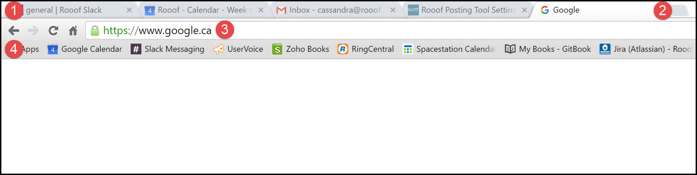
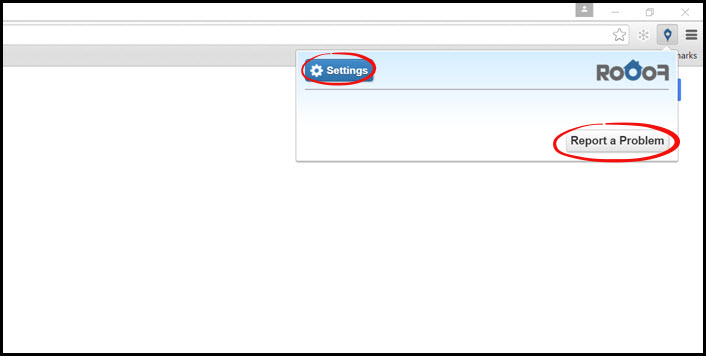

# Running

This page will explain the basic functions of Google Chrome.

##Browser Features

1. **Open Tabs** - These are the tabs you have open. In the photo, Google is the open tab.
2. **New Tab** - If you want to open a new tab, click the small square beside your last open tab.
3. **URL Bar** - This is where you type in web addresses. In Chrome, you can also search on Google by typing in this bar.
4. **Bookmark Bar** - These are bookmarks that are available for easy access. The bar is displayed on each tab. Clicking one of the bookmarks will take you to that page. If you do not see the bookmark bar, do not worry, you may just have it turned off. 

---

##Rooof in Chrome
If you have the Rooof Chrome extension installed, you will be able to see the Rooof logo in the top right hand corner.

By clicking the logo, you are able to access your settings, or report a problem.
