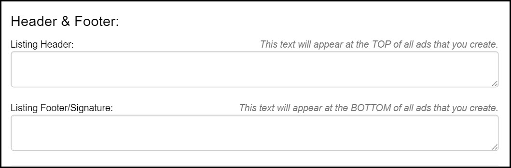
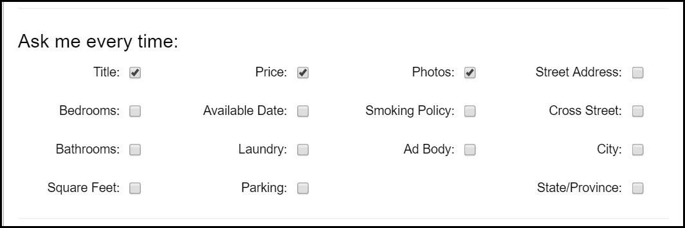
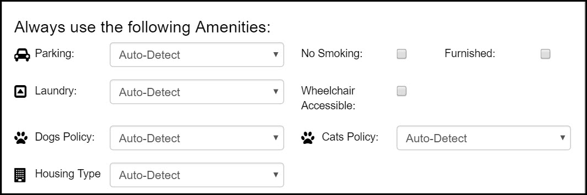
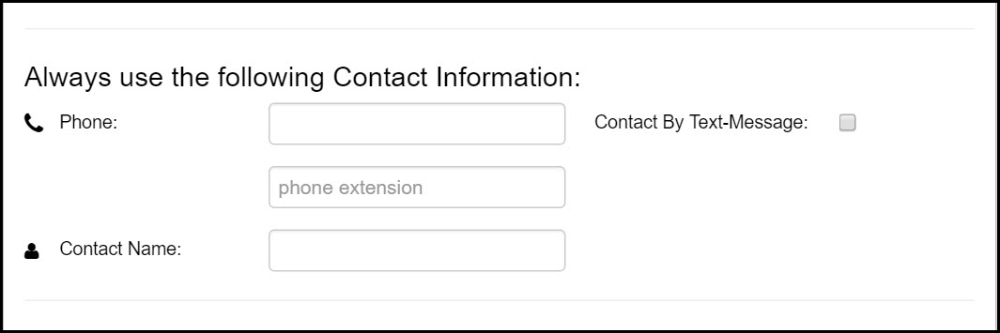
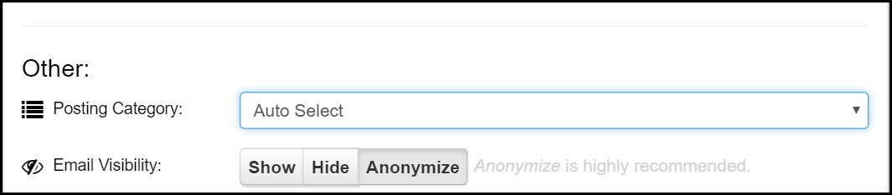
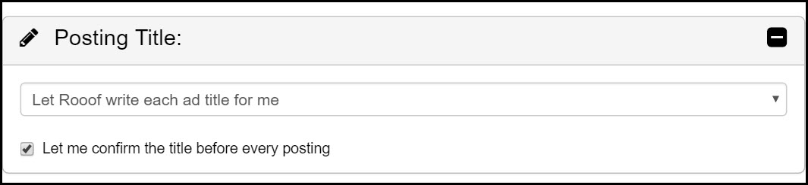
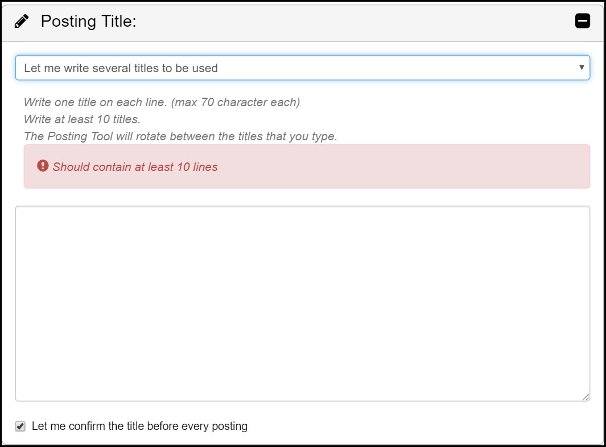
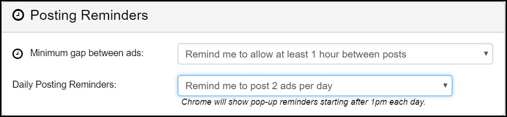

# Settings
This section explains the optional settings page of Rooof. The settings let you have more control of how Rooof will make your ads.

**To access your settings follow these instructions:**

1. Open your Google Chrome browser
2. Click the Rooof icon in the top right corner

3. Click "Settings" 

4. Click "Show Optional Settings" 

---
##Header and Footer

Fill in these sections if you want to have the same text at the top or bottom of all ads.
- Common headers include monthly specials or deals.
- Common footers include an equality statement or pricing disclaimers.
- ---

##Ask Me Every Time

Rooof automatially pulls these fields from your property website. If you want to review and have the option to change the information before compiling the ad, check the corresponding box.

- For example, if units with the same floor plan are priced differently within a property, you may want to check the "Price" box. This would allow you to enter the exact price for the specific unit you are posting before the ad is generated.
- ---

##Always Use the Following Amenities

When set to "Auto-Detect" Rooof will automatically pull information from the property website. If you want to select a permanent option for any of these categories, click the drop down menu and select an option. This setting will be applied to all ads generated for the property. 

---
##Location

If you always post to the same local Craigslist site, then you can tell Rooof to always use the same location. If not, then leave this setting at "Ask me Every Time, Show Best Guess". This setting will have Rooof ask you to confirm the location each time you post an ad.

---
##Contact Information

If you want Rooof to use different contact information than what is listed on the property website, fill in these fields.

---
##Other

**Posting Category** -  When set to "Auto-Select" Rooof pulls the posting category from your website. 
**Email visibility** - Determines what emails viewers see when they reply to an ad. We recommend that you keep this as "Anonymize" to reduce the risk of flagging.

---
##Posting Title

When set to "Let Rooof write each ad title for me" Rooof will randomly pull 3 amenities from the property website. Letting Rooof randomly make titles helps prevent ad flagging. You can check the box if you want to confirm the title before compiling each post.

If you select "Let me write several titles to be used" you can write your own titles. It requires you to enter at least 10 lines. Rooof will then randomly select a title to create variability to reduce the chance of being flagged.

---
##Posting Reminders

**Minimum Gap Between Ads** - 

1. [Auto Renew](https://rooof.gitbooks.io/rooof-user-manual/content/auto-renew.html)
