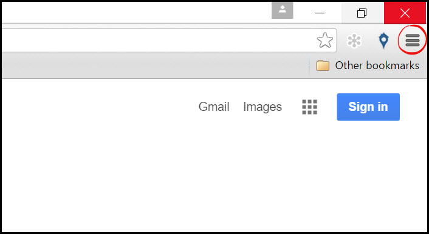
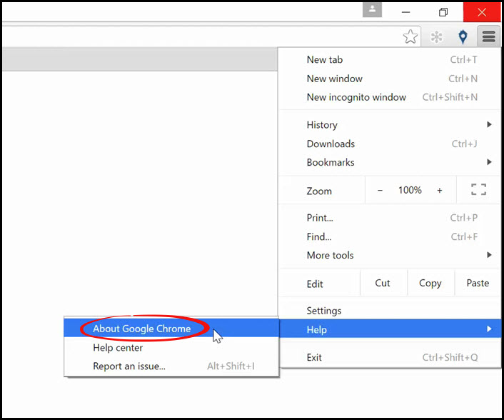
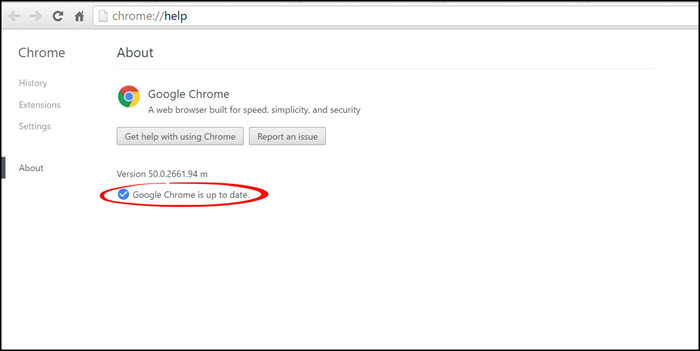

# Updating Google Chrome
This page will show you how to update your Google Chrome browser. It is a good idea to have the latest version for optimum performance.

Follow these steps:
1. Open your Google Chrome browser
2. On the top right corner, click the "Customize and control Google Chrome" button, displayed by three bars.
 

3. Under the help menu, click the "About Google Chrome" button
 

4. This page will tell you the version you are running, and if there are any updates available they will be here.

---

**You may also find interesting:**
- [Checking Chrome Version](http://docs.rooof.com/chromeversion_md.html)
- [Updating Chrome Extensions](http://docs.rooof.com/updatingextensions_md.html)
- [Using Multiple Chrome Profiles](http://docs.rooof.com/chromeprofiles_md.html)