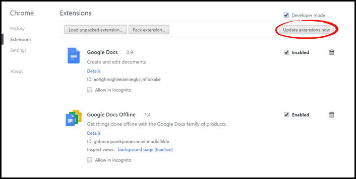

# Updating Chrome Extensions
This page will show you how to update extensions (like Rooof) on Google Chrome.

**Follow these Steps:**
1. Open your Google Chrome browser
2. Click the "Customize and control Google Chrome" button in the top right corner (three bars)
 

3. Go to "More tools" menu and choose "Extentions"
 

4. Check the "Developer Mode" box

5. Click the "Update extensions now" button

**Your extensions are now updated!**
