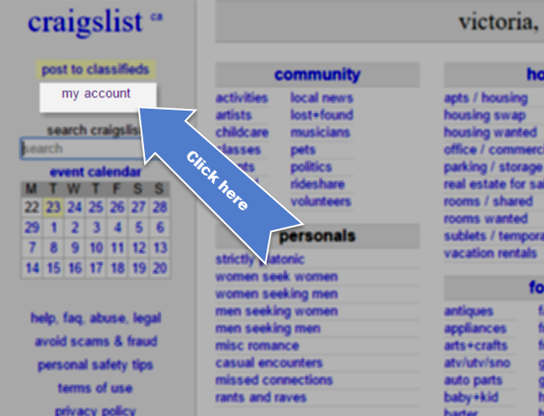

# User Guide Template

Please use consistent branding/design choices when adding content to the Rooof User Guide. 

All screenshots should match these design standards: 

**Aspect Ratio**

- Screenshots should follow a 4:3 aspect ratio.
    - Ex. 400px by 300px, 600px by 450px, or 800px by 600px. 
    - [Link to aspect ratio calculator](http://size43.com/jqueryVideoTool-4x3.html). 

**Spotlight & Magnify Settings**

Effects
- Magnify: 100%
- Dim background: 30%
- Blur background: 4%
- Drop shadow: checked

Position
- Horizontal offset: 0%
- Vertical offset: 0%

**Border**

- Image border width: 2px
- Image border colour: black

**Font** 

- Label tag fonts should be Ariel Black, size 12.

Using those settings, this is how a typical screenshot should look:

*This page can be deleted once the guide is complete. 