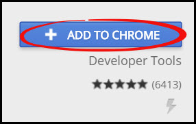
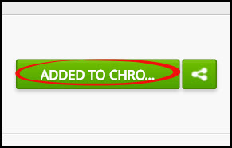

# Chrome Webstore
This page will show you how to access the Chrome Webstore. The Webstore has various apps and extentions for your Google Chrome browser.

[Link to Webstore](https://chrome.google.com/webstore/category/apps)

Once you are in the Webstore, you can browse by category, features, or ratings. You can also search for apps using the search bar. When you find an app you want to download, click the blue "**Add to Chrome**" button.  
 
Note: You cannot search for the Rooof posting tool app - you must have a direct link. Contact your account manager if you need this link.

When it has successfully downloaded, the button will change to green and say "**Added to Chrome**". 

---
**You may also be interested in:**
- [Installing Google Chrome](http://docs.rooof.com/installing_google_chrome.html)
- [Installing Chrome Extentions](http://docs.rooof.com/installchrome_extension_md.html)
- [Posting Button](http://docs.rooof.com/postingbutton_md.html)

